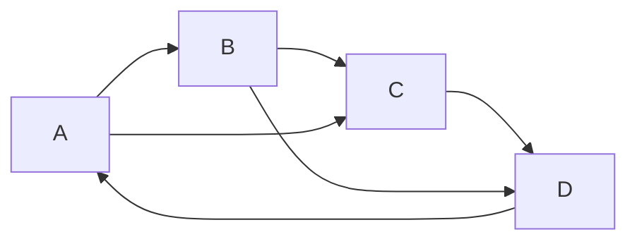

# My GitHub Repository

This is an example repository that demonstrates how to include a Mermaid.js diagram in your README.md file.

## Diagram

```mermaid
graph LR
    A-->B;
    B-->C;
    C-->D;
    B-->D
    A-->C
    D-->A
```
